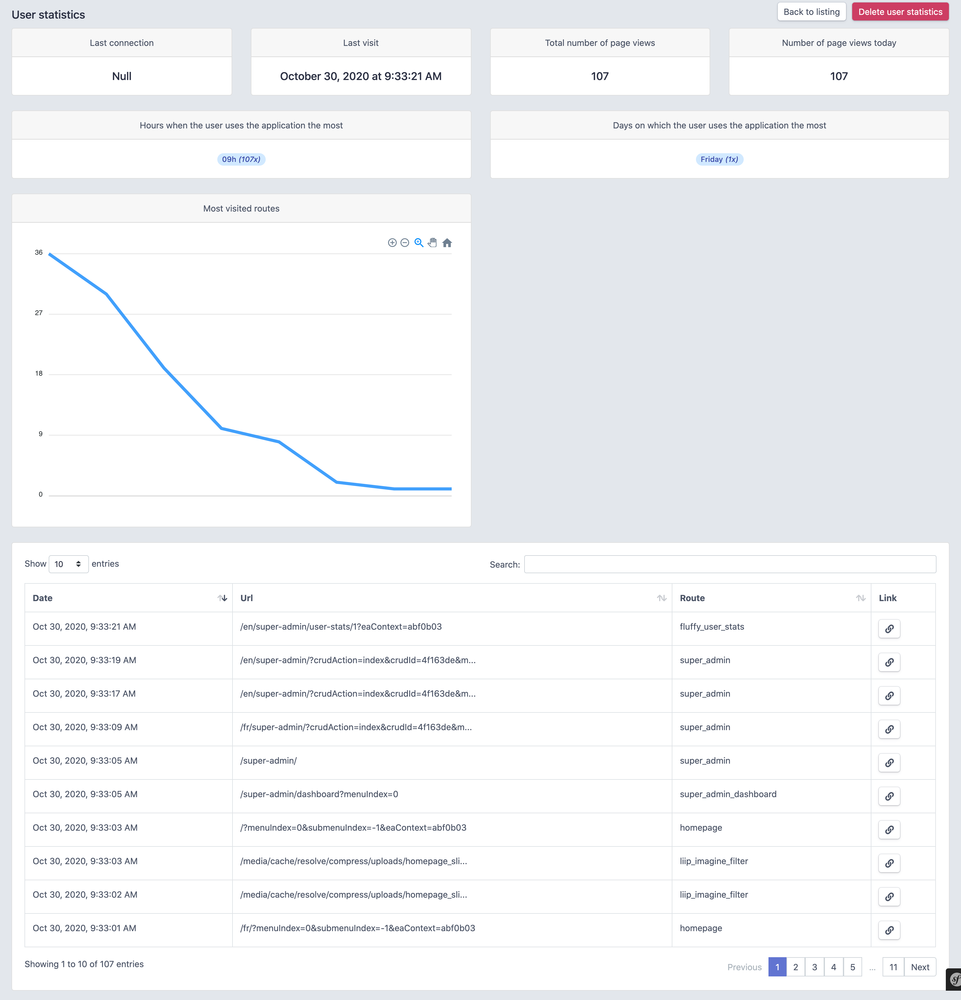

# User stats



## Introduction

You need to require Symfony 4.* or 5.* for use this bundle. (and Easyadmin 3.* for the easier installation)

### :rotating_light: Disclaimer

This bundle retrieves user information. You must ask permission from your users to use this bundle legally. Any negligence in the strict application of the recommended procedures relieves us of all responsibility for their use.

## Installation
```
composer require fluffy-factory/user-stats-bundle
```

## Configuration

You can create your own configuration in `config/packages/fluffy_user_stats.yaml`:

```yaml
user_stats:
  exclude_route: ["liip_imagine_filter"]
  user_stat_enabled: true
  max_month_before_archive: 6
  archive_enabled: false
```

### Entity

Add mixin Class `use UserStats` in your User entity
```php
class User
{
    ### ADD THIS ###
    use UserStats;

    ...
}
```

Make a database schema update

```
php bin/console d:s:u --force
```

Install assets 

```
php bin/console assets:install
```

### Routing

Create routes file `config/routes/fluffy_user_stats.yaml` with the below config:

```yaml
fluffy_user_stats:
  resource: "@UserStatsBundle/Controller/UserStatsController.php"
  type: annotation
  # prefix: /admin
```

### Archive

If you have a lot of users and the data table is getting too big; you can automatically archive your data older than 6 months (by default) in a data table named **user_stats_lines_archives**.

To enabled archive you need to set the **archive_enabled** at true.

```yaml
# config/packages/fluffy_user_stats.yaml
user_stats:
    archive_enabled: true
    # number of months before the data is archived
    max_month_before_archive: 6 
```

## Integration

### Easyadmin 3.*

Add custom actions in your entity configuration

```php
$userStats = Action::new('userStats', 'Statistiques utilisateur')
    ->linkToRoute('fluffy_user_stats', function (User $entity) {
       return [
           'id' => $entity->getId()
       ];
    });

return parent::configureActions($actions)
    ->add(Crud::PAGE_INDEX, $userStats)
        ->setPermission('userStats', 'ROLE_SUPER_ADMIN');
```
